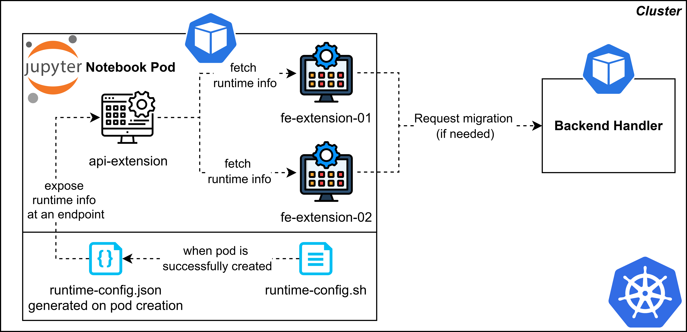

# JupyterLab GPU Optimizer on Kubeflow

Optimize GPU usage for JupyterLab running as Kubeflow Notebook custom resources on Kubernetes. The system automatically (or manually) migrates users between CPU-only and GPU-backed notebook pods, checkpoints data to persistent volumes (PV), and restores it to ensure a seamless experience.

> In this project, **“JupyterLab”** and **“Jupyter Notebook”** are treated as the same term.

---

## Overview

This project aims to optimize GPU usage when using JupyterLab on Kubernetes (JupyterLab runs as Kubeflow Notebook custom resources; Kubeflow is installed on top of Kubernetes and used as the platform for those resources).

* For background on the platform, see **[Kubeflow](http://kubeflow.org/)**.
* JupyterLab is considered an advanced version of Jupyter Notebook; in this context they are used interchangeably.

---

## Core Idea

**When on a CPU-only notebook pod**

* On each cell execution, a TypeScript front-end extension (**fe-extension-01**) checks whether the code needs a GPU.

  * **If GPU is not needed:** do nothing; the user continues on the CPU-only pod.
  * **If GPU is needed:** guide the user to migrate to a GPU notebook pod. Before moving, the extension checkpoints and saves working data to a **persistent volume (PV)**.

**When on a GPU notebook pod**

* If the user does not execute any GPU tasks for a period (e.g., 3 minutes; configurable), **fe-extension-01** helps migrate back to a CPU-only pod. Before moving, working data is checkpointed and saved to the PV.

**After any migration**

* Working data is restored from the PV into the new notebook pod to keep the user experience seamless.

**Manual control**

* A second TypeScript front-end extension (**fe-extension-02**)—built on top of fe-extension-01—lets users manually migrate between CPU-only and GPU pods as needed.

---

## Components

### Front-End Extensions (TypeScript)

* **fe-extension-01:** Detects GPU needs on cell execution, automates migrations, and triggers checkpoint/restore.
* **fe-extension-02:** Provides manual controls for migrating between CPU-only and GPU pods.

> Learn more about building JupyterLab extensions:
> **JupyterLab Extension Tutorial** – [https://jupyterlab.readthedocs.io/en/latest/extension/extension\_tutorial.html](https://jupyterlab.readthedocs.io/en/latest/extension/extension_tutorial.html)

### Server Extension (Python)

* **api-extension:** A Jupyter Server extension that exposes runtime configuration as an HTTP endpoint for the FE extensions to consume.

  * Runtime details include:

    * Whether the current notebook is using a GPU
    * Pod name
    * Pod namespace

> Server extension docs:
> **Jupyter Server – Extensions** – [https://jupyter-server.readthedocs.io/en/latest/developers/extensions.html](https://jupyter-server.readthedocs.io/en/latest/developers/extensions.html)

### Checkpoint/Restore

* **[jupyterlab\_kishu](https://github.com/illinoisdata/kishu)** is used to checkpoint working data before migration and restore it afterwards.

### Backend Handler (Go)

* **backend-handler:** A Go application that listens for POST requests from the FE/Server extensions and **creates/deletes Kubeflow Notebooks** automatically to move users between CPU-only and GPU pods.

### Base Images

* In the `Dockerfile`, if you want to build a Jupyter-based image for the `BASE_IMG` field, see **[Kubeflow example notebook servers](https://github.com/kubeflow/kubeflow/tree/master/components/example-notebook-servers)**.

**Build, Tag, and Push the Docker image**

   ```
   docker build --network=host -t new-jupyter-tensorflow-cuda:v0.2 .
   docker tag ...
   docker push ...
   ```

---

## How It Works (End-to-End Workflow)

1. **Startup script installed during image build**
   `entrypoint.sh` is copied and granted execution permission when building the Docker image (see `Dockerfile`). Its deployed name is **`runtime-config.sh`**.

2. **Runtime configuration generated on container start**
   After the pod is created and the container starts, **`runtime-config.sh`** runs **before** JupyterLab launches. It detects whether the pod has GPU access and records:

   * GPU usage status
   * Pod name
   * Pod namespace
     The data is written as JSON to **`runtime-config.json`** inside the container.

3. **Server extension exposes runtime info**
   The **api-extension** reads `runtime-config.json` and exposes the information at:

   ```
   /<base_url>/api_extension
   ```

4. **Front-end extensions drive migration**
   **fe-extension-01** and **fe-extension-02** fetch the runtime info from the server extension’s URL. Based on that info and user activity, they issue POST requests to the **backend-handler**, which creates/deletes Kubeflow Notebook resources to migrate the user:

   * CPU-only → GPU
   * GPU → CPU-only
     Before any switch, data is checkpointed to PV; after the switch, it’s restored.


---

## Links & References

* Kubeflow: [http://kubeflow.org/](http://kubeflow.org/)
* JupyterLab Extension Tutorial: [https://jupyterlab.readthedocs.io/en/latest/extension/extension\_tutorial.html](https://jupyterlab.readthedocs.io/en/latest/extension/extension_tutorial.html)
* Jupyter Server Extensions (developer docs): [https://jupyter-server.readthedocs.io/en/latest/developers/extensions.html](https://jupyter-server.readthedocs.io/en/latest/developers/extensions.html)
* Checkpoint/restore: **jupyterlab\_kishu** – [https://github.com/illinoisdata/kishu](https://github.com/illinoisdata/kishu)
* Kubeflow example notebook servers (base images):
  [https://github.com/kubeflow/kubeflow/tree/master/components/example-notebook-servers](https://github.com/kubeflow/kubeflow/tree/master/components/example-notebook-servers)

---

## Notes

* The GPU idle timeout (e.g., 3 minutes) is configurable.
* The project assumes JupyterLab and Jupyter Notebook are interchangeable in this context.

---

## Acknowledgements

Thanks to the Kubeflow and Jupyter communities for the tooling that makes this workflow possible.
